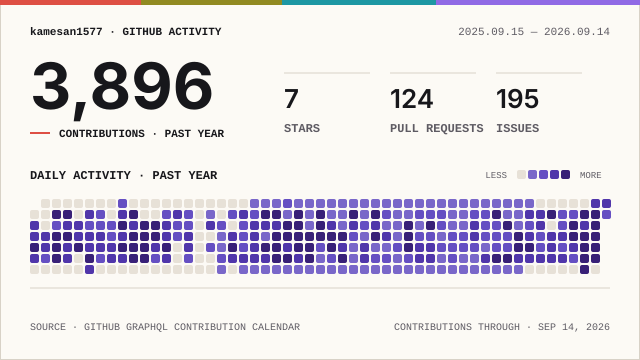

<div align="center">

# kamesan1577


</div>

```text
╭─ kamesan1577@github ~
╰─$ whoami
バックエンドエンジニア

╭─ kamesan1577@github ~
╰─$ ls ~/homelab
Proxmox  Tailscale  self-hosting

╭─ kamesan1577@github ~
╰─$ cat ~/.config/ai
ChatGPT  Claude  Codex  harness engineering

╭─ kamesan1577@github ~
╰─$ ls ~/engineering
TDD Go
test harness
API design

╭─ kamesan1577@github ~
╰─$ ls ~/media
涼宮ハルヒの憂鬱
STEINS;GATE
MMO
ニコニコ
ゲーム史
ゆるコンピュータ科学ラジオ
```

<div align="center">
  <picture>
    <source media="(prefers-color-scheme: dark)" srcset="./profile/signal-field-wide-dark.svg">
    
  </picture>
</div>
